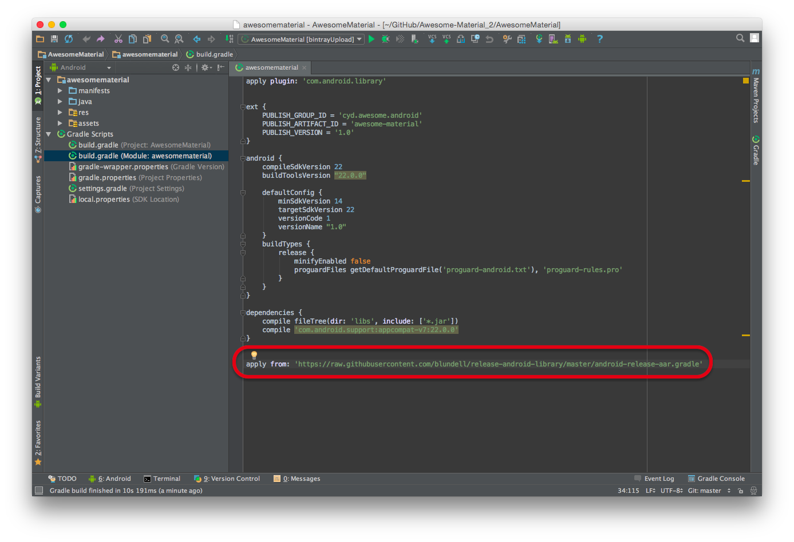
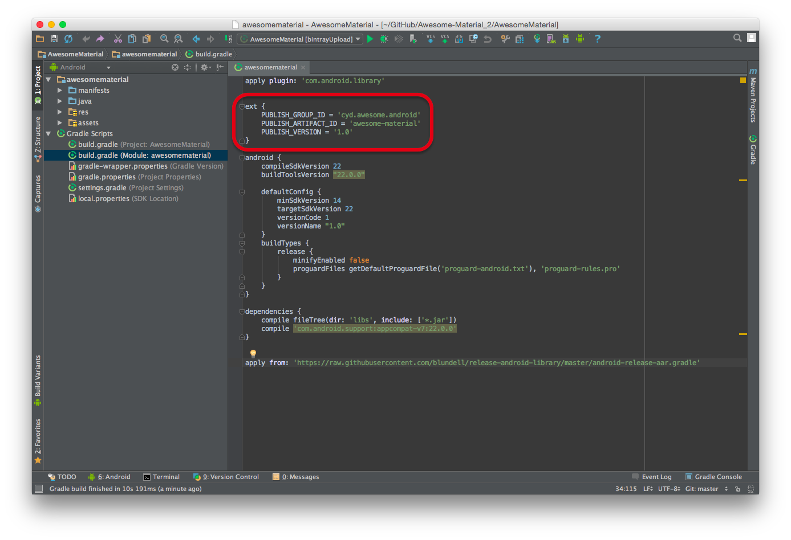
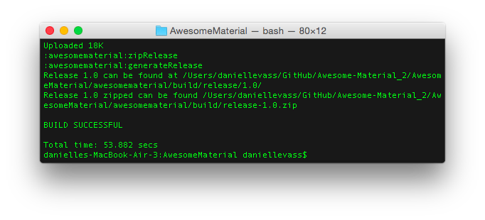
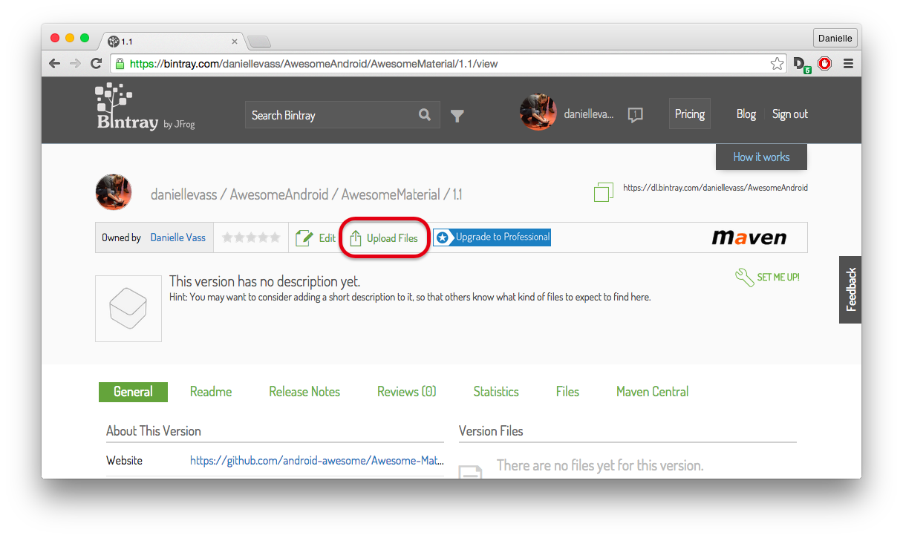
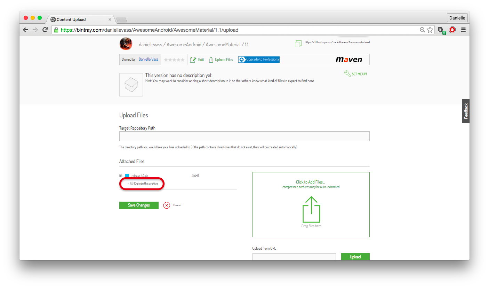
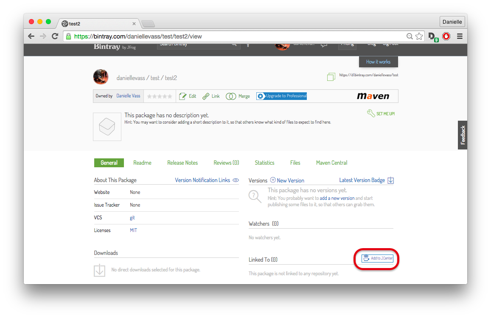

# 发布Library到JCenter可以这么简单

>前些天写了一个Library想发布到JCenter，好让大家用起来方便点，于是百度了一下如何上传Library到JCenter，不查不知道，一查吓一跳，每个教程看起来都是那么的繁琐，根本没心情看下去，于是去Google找找，看看大神们有没有更简单的方法，于是我找到了下面这篇文章：

#### [原文：How to Publish Your Android Studio Library to JCenter](https://medium.com/@daniellevass/how-to-publish-your-android-studio-library-to-jcenter-5384172c4739)

#### 1.修改Gradle文件
首先，打开你的Library的build.gradle文件，我们要引用一个脚本用来生成我们的`.aar`文件，这个脚本的地址是：[GitHub](https://github.com/blundell/release-android-library)

````
apply from: 'https://raw.githubusercontent.com/blundell/release-android-library/master/android-release-aar.gradle'
````


#### 2.添加配置信息
接下来，我们需要添加一部分配置文件到同一个gradle.build，下图中的第一行表示它为一个Android Library。

用户使用时的Compile就是根据这些信息来生成的，所以在填写的时候要小心一点，保证唯一

示例如下：

````
ext {
    PUBLISH_GROUP_ID = 'cyd.awesome.android'
    PUBLISH_ARTIFACT_ID = 'awesome-material'
    PUBLISH_VERSION = '1.0'
}
````



#### 3.生成文件

我们已经准备好要生成一个.zip文件了，是的，你没有看错，就是这么几行简单的配置，接下来就是打开终端（Windows用户请自行Google如何操作），输入一串命令来执行

````
./gradlew clean build generateRelease
````
在耐心的等待命令执行完毕后，你应该会看到 `BUILD SUCCESSFUL`这句话，同时它也会提示你release zip文件的路径。



这时候如果你打开对应的路径，应该能看到一个release-x.x.zip的压缩文件。

#### 4.Bintray

接下来就是在[Bintray](https://bintray.com)，Bintray允许你上传文件，并允许别人下载。

###### 4.1 创建一个新的Repository

你需要做的第一件事情是创建一个新的Repository，它是一个组织的名字，可以包含多个项目，跟GitHub有点区别

###### 4.2 创建Package

接下来我们要在Responsitory中创建一个新的package，这个相当于项目的名称，别人看不到这个名字。

###### 4.3 创建新的Version

最后呢，我们要创建一个版本，版本号不是必须为数字，你可以取任何的名字，不过我建议最好还是用常规的版本号

###### 4.4 上传文件

经过上一步呢，我们现在就已经与一个版本了，`Upload Files`我花了好久才找到，注意一定是在Version对应的页面才有这个按钮



###### 4.5 一个小小的CheckBox

接下来你应该就可以上传zip文件并上传了，但是在上传之前，一定要记得勾选`exploding the archive` CheckBox，否则的话你的项目就会不起作用！！！



###### 4.6 JCenter request

下一步你要做的是是请求JCenter和你的项目关联起来，这样你的Library就会能够通过gradle dependencies找到

如果你进到`project`页，那么在右下角会有一个`add to jcenter`的小安妮，点击后填写简单的信息，等待通过后（一般几个小时吧），你的Library就和JCenter关联起来了。



###### 4.7 最后

等待几个小时审核通过以后，就可以通过依赖的方式找到你的项目啦，例如，我的依赖如下：

````
compile 'cyd.awesome.android:awesome-material:1.0'
````